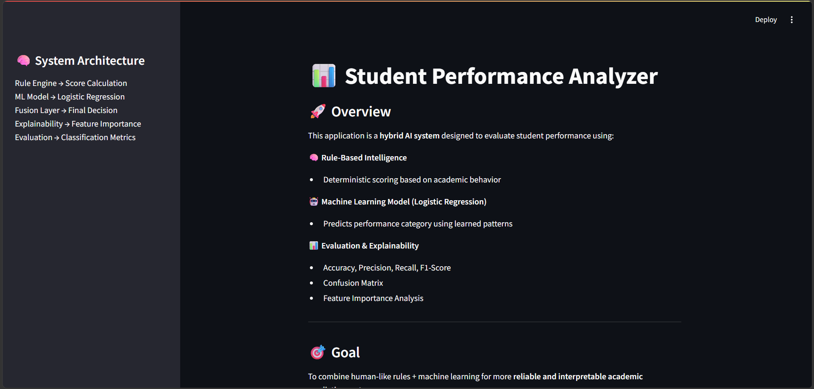
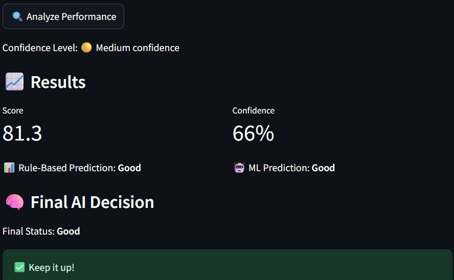
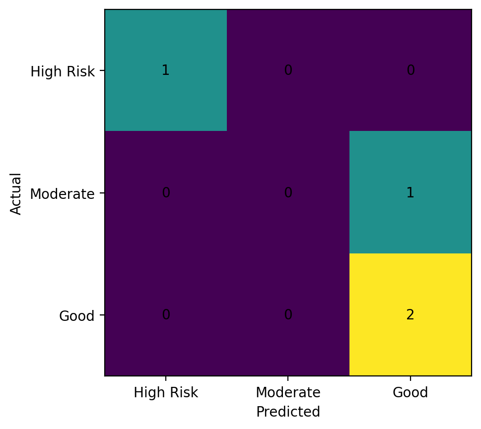
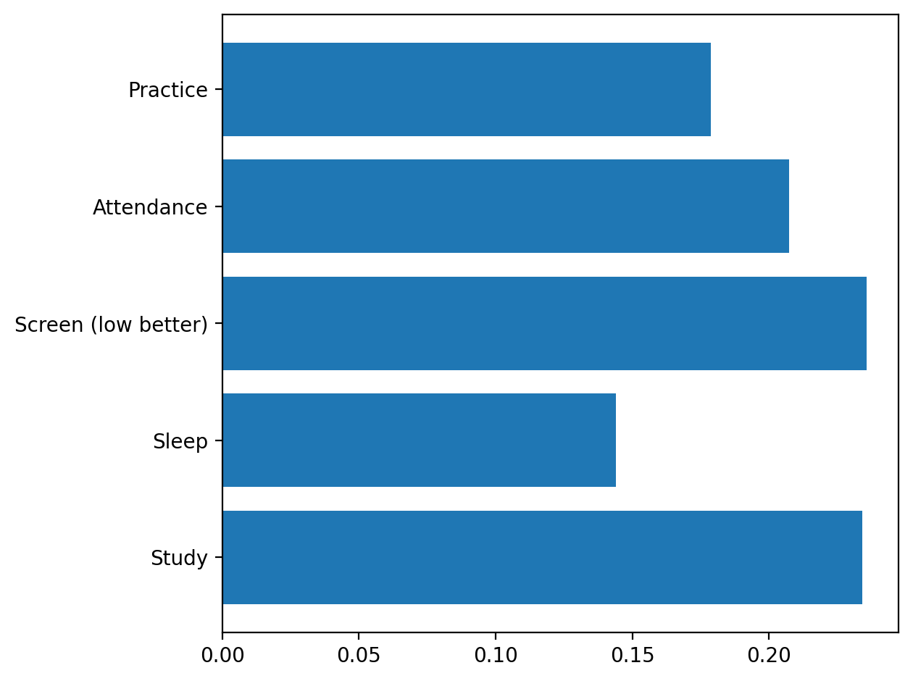

# 📊 Student Performance Analyzer (Hybrid AI System)

An intelligent Streamlit-based web application that predicts student performance using a **Hybrid AI approach combining Rule-Based Scoring and Machine Learning (Logistic Regression).**

---

## 🚀 Project Overview

This system analyzes student behavior and academic patterns such as:

- Study Hours  
- Sleep Patterns  
- Screen Time  
- Attendance  
- Practice Score  

It predicts student performance into:

- 🟥 High Risk  
- 🟡 Moderate  
- 🟢 Good  

---

## 🧠 System Architecture

Rule-Based Engine → Machine Learning Model → Fusion Decision Layer → Final Prediction → Evaluation Metrics

---

## ⚙️ Key Features

- 🧠 Rule-Based Scoring System (Human Logic)
- 🤖 Logistic Regression Model (ML Prediction)
- 🔀 Hybrid Decision Fusion System
- 📊 Model Evaluation (Accuracy, Precision, Recall, F1-Score)
- 📉 Confusion Matrix Visualization
- 📈 Feature Importance Analysis
- 🎛 Interactive Streamlit Dashboard

---

## 📊 Machine Learning Details

- Algorithm: Logistic Regression  
- Train-Test Split: 70-30  
- Evaluation Strategy: Stratified Sampling  

### Output Classes:
- High Risk  
- Moderate  
- Good  

---

## 🛠 Tech Stack

- Python  
- Streamlit  
- NumPy  
- Matplotlib  
- Scikit-learn  

---

## 📸 UI Preview

Below are screenshots of the working application interface:

### 🏠 Home Page

  

### 🎛 Prediction Interface

  

### 📊 Confusion Matrix

  

### 📈 Feature Importance Graph

  

## 📌 Key Insights

- Built a hybrid AI system combining rule-based logic with machine learning for better interpretability.
- Identified how behavioral factors like study time, sleep, and screen usage influence student performance.
- Demonstrated that combining deterministic rules with ML improves decision reliability.
- Learned importance of feature importance analysis in understanding model behavior.

---

## ⚠️ Limitations

- Small synthetic dataset used for training  
- Model is for demonstration purposes only  
- Does not represent real-world student population fully  
- Limited feature diversity affects generalization  

---

## 🔮 Future Improvements

- Integrate real-world student datasets  
- Improve accuracy using advanced feature engineering  
- Experiment with advanced ML/DL models  
- Deploy application on cloud (Streamlit Cloud / AWS)  
- Add user authentication system  
- Expand feature set for better prediction accuracy  

---

## 👨‍💻 Author Note

This project was built as part of a personal learning journey in Data Science and Machine Learning. It demonstrates the integration of rule-based systems with machine learning to build interpretable AI solutions for educational analytics.

---

## 📬 Contact

- GitHub: https://github.com/s-sibgha  
- LinkedIn:https://linkedin.com/in/sibgha-3665a1377  

---

## ⭐ Final Statement

This project demonstrates how hybrid AI systems can be used to combine human logic and machine learning for more interpretable and reliable predictions in real-world educational scenarios.
